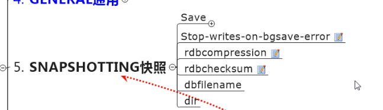
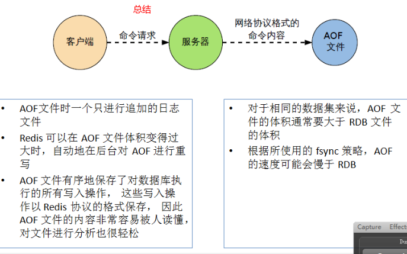

### 1,Redis简介

redis是一个在内存里的分布式缓存服务器


### 2, Redis常用命令

#### (1), key相关命令


#### (2),String操作相关命令


#### (3)List相关命令， 


#### (4)set相关命令


#### (5)Hash相关命令

kv模式不变，但v是一个键值对


#### (6)ZSet相关命令


- 遍历ZSet

  

  

- 第一个表示60<= x <90小括号表示不包含


### 3, redis配置文件相关

- tcp-backlog, 在高并发时的设置


- tcp-keepalive : 作用是在多个redis同时使用时，隔一段时间给一个redis发消息，看是否有回应，目的是检查其是否正常运行。


- syslog-enabled


- limits

  maxclients : 最大连接数


- maxmemory-policy : 缓存清除策略


- maxmemory-samples


- 常用配置

  


### 4, 持久化-RDB

redis会在关闭之前迅速把数据备份到硬盘，备份文件名字是dump.rdb

dump.db文件的保存路径由/bin/conf/redis.conf或/etc/redis/6379.conf中的"dbfilename指定"

- （1）RDB概念

  **RDB这种按时间间隔保存备份数据有个问题，例如，如果每5分钟一保存，一旦保存完一次，过了3分钟的话，redis出故障或关机**

  **那这最后3分钟的数据就没办法保存了。**


- （2）fork概念


- （3.1）dump.rdb的备份策略之一，保存快照sanpshooting，即本分dump.rdb的时间设置策略，可自定义该设置。

  RDB(dump.rdb)就是整个内存压缩过的snapshoot快照

  如果900秒至少有一个键key内容变更，则备份dump.rdb到硬盘；

  如果300秒内至少有10个key变更，则备份dump.rdb到硬盘；

  如果60秒内至少有10000个key次的变更，则备份dump.rdb到硬盘；


- （3.2）dump.rdb的备份策略之二。

  执行flushall命令后也会迅速备份dump.rdb到硬盘，类似与MySql的commit命令，因此flushall命令执行之前最好备份原有的dump.rdb文件到别处命名为dump_bak.rdb；

  因为执行flushall命令后备份到硬盘的dump.rdb文件里什么数据也没有，被清空了；

  shutdown命令执行后也会迅速备份dump.rdb到硬盘；

  redis意外关闭时也会迅速备份dump.rdg到硬盘。

- (3.3) 如果要禁用RDB持久化策略，即不备份dump.rdb，则在redis.conf文件中不设置任何save策略，即注释掉，或给save赋值空 ：“” 即可；

- (3.4)在redis-cli界面执行save命令可立即手动备份dump.rdb，不需要等到redis按策略自动备份；

  

- (5)如果执行/usr/local/bin/redis-cli命令，即不在bin目录下启动redis-cli窗口，则保存的dump.rdb文件会在当前的启动目录

- (6)snapshot相关

  

  


- (7)redis恢复数据

  

- (8)总结


### 5, 持久化-AOF

​        AOF自动备份持久化策略默认是关闭的，需在配置文件中手动设置开启。

​        （1）AOF(Append  Only  File)的备份方法是，当 redis有写，改，删的操作时，把写的语句存进appendonly.aof文件中，读的语句   不备份，没必要；

​          (2)  这种做法有个问题有个缺陷，即如果执行set k1 10 后,  incr  k1 执行一万次，那就得存储一万条语句占用磁盘空间太多，不如直接写成set   k1  10000，但AOF无法写 set   k1  10000这个语句，它只会复制你写入的语句；

​          (3)”flushall “  命令也会记录，如果flushall执行完毕后，使用shutdown关闭或其它情况意外关闭redis，appendonlu.aof文件中最后一条flushall， 恢复数据时记得删除，redis重启会自动恢复数据，因此在重启之前把这个命令删除；

​		  (4)AOF的备份文件appendonly.aof在redis重启恢复时的优先级高于dump.rdb;

​          (5) AOF在复制写入的语句时，有可能正复制到一半突然断电等原因导致redis关闭，那appendonly.aof文件中最后一行的语句就不符合redis语法规范，下次redis重启时由于要优先加载appendonly.aof文件，这时回报错导致redis启动不了。

​               解决办法：在bin目录中找到" redis-check-aof"，执行 ： redis-check-aof  --fix  appendonly.aof 可自动取出最后的不符合语法规则的语句。注意这里appendonly.conf在bin目录下。redis-check-dump命令同理。


- redis.conf有关AOF的设置

  

  appendfsync  :  


- rewrite相关, 重写，指当aof文件达到指定大小时，会进行重写，把原来的文件的进行优化，去掉多余的语句，保证占用容量最小。

  


- 优劣势

  

- 总结

  

  

  

  

### 6, Redis事务

1，Redis的事务底层是CAS算法（Compare and swap）, 参照 JUC

****

2 ，Redis常用事务命令

##### 一，使用事务步骤

multi : 开启事务，redis-cli页面执行，执行此命令后再执行添加例 "set  k1  v1"的话，不会保存进库里，会显示 "QUEUED "表示排队，

​           再添加“set  k2  v2”还是排队，直到执行 “ exec”才会添加进去；

exec :  执行事务队列中的所有命令；

discard :  放弃事务，指在 “multi”命令执行后，set   k1  10,  set k2  20 ,  输入“discard”后，前面两条set命令无效 ，与mysql的rollback命    				 令同理；

##### 二， Redis事务中的两个特点

**(1)连坐** ：指在开启事务后，有一个或多个命令在执行时就报错，那么在它前后的正确命令在执行"exec"都无效

例： multi    ： 开启事务

​		set k1  v1  :正确命令

​         getset  k3  :   语法错误，少一个参数，应该是 getset   k3   Jerry ,  这里会当场报错“(error) ERR wrong number of arguments for     								'getset' command”，类似于java的编译异常，编译就不通过，所有都不编译了。

​        set   k5  v5  : 正确命令

​        exec :  提交事务，提交后一个命令也没执行，此称作连坐效应

**(2) 冤有头债有主**：指在开启事务后，有一个或多个命令在执行时没报错，而在"exec"执行时有问题，那只有这个命令无效，其它的都有  效；

例： 原库中有k2   "abc"  

​		multi  :  开启事务         

​		set    k6   v6 :  正确语法

​		 incr   k2  :  k2的值是"abc"无法自增， 但这里不报错

​         set   k7  v7 :   正确语法

​         exec  :  执行提交事务后，incr  k2命令会失败，别的都会执行成功，类似于java运行时异常

##### 三 ， watch命令相关

watch命令在multi命令之前使用，用来监视当前操作的数据是否被他人修改，是个乐观锁，也类似于CAS算法

例：信用卡额度，账单范例

set   balance  :  100  , 初始设置额度为100

set   debt  :  0  ， 欠款为0

watch   balance  debt :  开启监视, 可同时监视一个或多个key

multi  :  开启事务

set  balance  80 : 

set  debt  :  20

exec  :  提交事务               ==> 如果在执行exec提交事务之前在别的地方对数据进行操作，进行加塞例：  set   balance   100,  则exec执行													失败，事务回滚

watch监视哪个key,  这个key在别处有改动就是执行提交exec命令时失败。

unwatch  :  取消监视


watch命令相关


### 7, Redis的发布订阅

常用命令：

在redis-cli界面执行：

subscribe  ch01  ch02  ： 订阅频道 ch01  ch02，发布的名字必须和ch01, ch02一致才可接收

unsubscribe  ch01  ch02  :  退订这两个频道

publish  ch01  "Hello Redis!"  :  在频道ch01发布消息， 注意后面的内容需加引号，否则报错；

psubcribe  news* :  订阅频道名含有 news的所有频道， 通配符的使用，可订阅多个psubcribe  news*   nfl*

publish  news-cctv5    “Liu Xiang wins”:   发不此消息可被上条psubscribe   news*接收

punsubscribe  news*  :  退订该频道


### 8， Redis的主从复制

模拟主从练习时可以在一个Linux中启动多个redis, 但是要带不同的配置文件启动，

即redis-server   conf/redis6379.conf

​    redis-server   conf/redis6380.conf 

​    Jedis中设置主从模式后，使用从机对象 Jedis  jedisSlave.get("k1")会有延迟，第一次可能获取不到，因为代码在内存中执行，比较快，从机还没复制

​    一般不使用Jedis类设置主从复制，都在后台使命下面的命令行执行，再Java代码里一般多用set, get来读写值

#### （1）常用命令：

slave of 127.0.0.1 6379 : 设置当前该redis服务为127.0.0.1 6379的从机（如果在同一台机器上，注意当前redis的端口需与6379不同）

执行此命令后会把主机中之前所有数据备份到slave从机里，以后主机写一句从机就跟着备份一句。

#### （2）读写分离

主机写，从机对于相同的key只能读，不能写或覆盖

例 ： set  k1  v1  :  在主机上进行写操作

​          set  k1  v12  :  在从机上对同样的键k1进行修改覆盖(写) ,  这时会报错，提示k1是只读的

说明为了保证主句数据的完整型，从机不可对主机中的数据进行修改，只能读。

#### （3）容灾恢复的情况，主机或从机挂掉时的情况处理

一，如果主机意外关闭，从机原地待命，执行info replication命令显示还是slave从机，

​       当主机开启时还会自动连接上，继续进行备份。主机还是主机，从机还是从机；

二，如果从机意外关闭，那就表示与主机断开连接了，再重启从机后不会自动连接主机，需要手动连接。

​       除非写进配置配件里让它启动时自动按参数连接

#### （4）一主二仆，薪火相传，反客为主

一主二仆： 指一个主机，其它都是从机，所有从机都直接从主机这里复制数据，其缺点是中心化严重，主机负担过重。

薪火相传： 指设置一个主机甲，设置乙为甲的从机，设置丙为乙的从机，这样可减轻主机甲的负担。缺点是可能会造成数据传递过程中					的丢失。

​                   设置方式：在乙从机里执行 slave   of   127.0.0.1  6379   (甲的IP地址端口号) ;

​                                      在丙(6381)从机里执行 slave   of    12.7.0.0.1  6380  (乙的IP地址端口号)  ;

​                    注意，如果在乙中执行 info  replication 命令查看信息，显示乙仍然是从机slave ;

反客为主： 指在一主二仆的情况下，主机甲出故障关闭了，在从机乙中执行命令 slave  of   no  one  解除主从绑定，

​					然后再丙中执行 slave  of   127.0.0.1  6380(乙的IP和端口)，则乙变成主机，丙就是乙的从机了；

​					若甲再回复启动，也不会是乙丙的主机了，自己是独立的。

####    (5)  复制原理

从机中执行slave  of ...命令后首先会全量复制主机中以前的数据，然后会增量复制主机中之后的数据。

####   (6) 哨兵模式 

 哨兵模式类似于反客为主的自动模式，工作原理是监视主机，如果主机出意外关机，就在其从机中立即投票选出新的主机进行服务。

 哨兵模式设置步骤：

一，在/usr/local/bin/conf/目录下新建文件(不是复制redis.conf)sentinel.conf ， 名字固定不可变，在文件中写入以下内容：

​        sentinel   monitor   host6379     127.0.0.1   6379   :  host6379是自定义的名字，后面是监视的主机ip地址端口号

​                                                                                                  可写多行，监视多个主机

  二，再bin目录下执行命令：

​       redis-sentinel    sentinel.conf  :   把哨兵配置文件加载进来

**注意：在哨兵模式下， 如果原主机恢复，就不再是主机了，redis会扫描把这个恢复的主机变成从机，是新的主机的从机。**


复制缺点：复制延时


### 9，JedisPool


### 10,Redis是单线程，所以自然是线程安全的

### 11,Redis集群

redis集群设置：

1）redis集群中至少有三个主服务，三个从服务，因此总共至少有六个服务

2）如果一个主服务挂掉，其对应的从服务会自动升级为主服务，挂掉的主服务再恢复则变为从服务

3）如果一主一从挂掉，整个redis集群就默认不可用了，如需设置可用须在cluster.conf文件中设置下面参数为no

```conf
#cluster-require-full-coverage yes  默认是注释的，默认值是yes
cluster-require-full-coverage no
```

4）Redis里的集群会自动重定向，即在6379添加数据，会自动分配到集群中的别的端口的redis，在6379端口获取键值对，会在所有端口的集群中寻找。

5）多键操作是不被支持的，mset等方法使用有问题，不能把mset设置到不同的端口里，或插槽slot里